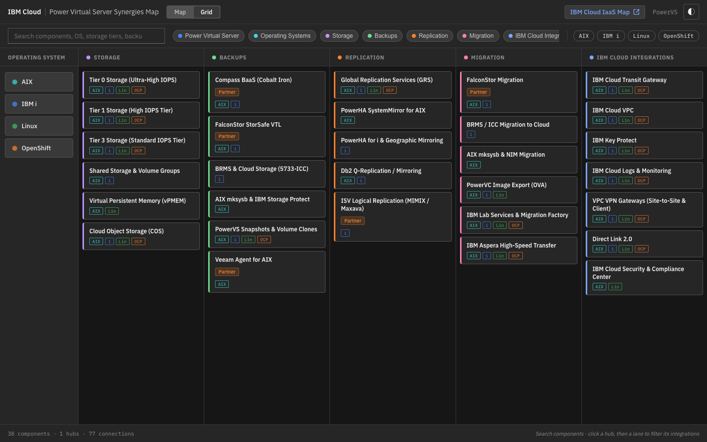

# IBM Power Virtual Server Synergies Map

An interactive synergy and architectural relationship map for IBM Power Virtual Server (PowerVS) in IBM Cloud. Visualises how PowerVS connects across hardware generations, operating systems, storage, backups, replication, migration, and IBM Cloud platform services.

**Live site:** [pvs-synergy-map.vercel.app](https://pvs-synergy-map.vercel.app)



## Architecture Layers

| Lane | Components |
|---|---|
| **Power Virtual Server Core** | IBM Power Virtual Server (hub) · Power11 · Power10 · Power9 _(existing clients only)_ |
| **Operating Systems** | IBM AIX · IBM i (AS/400) · Linux on Power (RHEL / SLES) · Red Hat OpenShift on Power |
| **Storage** | Tier 0 (Ultra-High IOPS, 25 IOPS/GB) · Tier 1 (High IOPS, 10 IOPS/GB) · Tier 3 (Standard IOPS, 3 IOPS/GB) · Shared Volumes & Volume Groups · Virtual Persistent Memory (vPMEM) · Cloud Object Storage |
| **Backups** | Compass BaaS (Cobalt Iron) · FalconStor StorSafe VTL · BRMS & 5733-ICC · AIX mksysb / IBM Storage Protect · PowerVS Snapshots & Clones · Veeam Agent for AIX |
| **Replication** | Global Replication Services (GRS) · PowerHA SystemMirror for AIX · PowerHA for i & Geographic Mirroring · Db2 Q-Replication · ISV Logical Replication (MIMIX / Maxava) |
| **Migration** | FalconStor Migration · BRMS/ICC Cloud Save & Restore · AIX mksysb & NIM · PowerVC OVA Export · IBM Lab Services & Migration Factory · IBM Aspera High-Speed Transfer |
| **IBM Cloud Integrations** | Transit Gateway · IBM Cloud VPC · Direct Link 2.0 · Key Protect · IBM Cloud Logs & Monitoring · VPC VPN Gateways · IBM Cloud Security & Compliance Center |

## Features

### Views
- **Grid view** _(default)_ — OS column on the left; integration categories (Storage, Backups, Replication, Migration, IBM Cloud Integrations) span right in columns. Click an OS button to highlight all supported integration cards for that OS; no lines needed.
- **Map view** — Force-directed node-link diagram showing the full connection graph with lanes, hub nodes, and typed edges.
- **View toggle** — Switch between Grid and Map via the toggle in the header bar.

### Navigation & Filtering
- **OS filter chips** — Header chips (AIX · IBM i · Linux · OpenShift) filter both views to show only nodes and connections relevant to that OS.
- **Lane filter** — With an OS selected, click any lane chip to drill down to the intersection of that OS and lane — e.g. all IBM i backup options.
- **Grid OS buttons** — Clicking an OS button in grid view highlights matching integration cards and opens the OS detail panel in the sidebar.

### Search
- **Full-text search** across labels, descriptions, discovery questions, competitors, and differentiators.
- **Grid search highlights** — In grid view, matching integration cards are highlighted and the OS buttons for their supported OSes are lit up. Non-matching items are dimmed. Searching `falconstor`, for example, highlights the FalconStor cards and the AIX / IBM i OS buttons.
- **Match count** — The search bar shows the number of matching components in real time.

### Sidebar detail panel
- **Node selection** — Click any node or card to see its direct connections, seller value proposition, discovery questions, key differentiators, and documentation links.
- **OS compatibility pills** — Each node displays colour-coded OS compatibility badges (AIX · IBM i · Linux · OpenShift).
- **Supported versions table** — AIX and IBM i nodes show a version table (Version / Min TL-TR / Hardware / Stock Image).
- **IBM i Software Tiers table** — IBM i node shows VST tier details (P05–P30: max vCPU, max RAM, licensing model, notes) with a link to the IBM docs.
- **In-flow sidebar expansion** — In grid view the sidebar expands in-flow so integration columns compress rather than being overlaid.

### Visual details
- **Power9 restriction notice** — Power9 nodes carry an `EXISTING CLIENTS ONLY` badge; new deployments must use Power10 or Power11.
- **Connection types** — Solid lines = native, dashed = platform integration, dotted = optional/partner.
- **Partner / ISV badges** — Partner and restricted-status cards carry labelled badges.
- **Dark / light theme** toggle.

## Data Files

```
data/
  views.json               # View registry
  powervs/
    plays.json             # Lane definitions and play order
    products.json          # All nodes (id, label, cat, os[], hub, status, desc, …)
    connections.json       # All edges (from, to, kind, mechanism, lane, status, summary, …)
```

### Product `status` values

| Value | Meaning |
|---|---|
| `ga` | Generally available |
| `partner` | Partner / ISV offering |
| `restricted` | Available to existing clients only (e.g. Power9) |
| `deprecated` | No longer recommended |
| `coming_soon` | In preview or planned |

### Connection `kind` values

| Value | Rendering | Meaning |
|---|---|---|
| `native` | Solid line | Built-in, automatic relationship |
| `platform` | Dashed line | First-class IBM Cloud integration |
| `optional` | Dotted line | Seller or architect choice |

### Extended product fields

| Field | Type | Description |
|---|---|---|
| `supportedVersions` | array | OS version rows rendered as a table in the sidebar (Version, Min TL-TR, Hardware, Stock Image) |
| `softwareTiers` | array | IBM i VST tier rows (P05–P30) rendered as a table with licensing details |

## Local Development

This project uses [`mise`](https://mise.jdx.dev/) for task running.

```bash
# Validate data feed integrity and start local server on http://localhost:4173
mise run dev

# Stage all files and commit to git
mise run git:commit -- "feat: your commit message"

# Deploy preview to Vercel
mise run deploy:preview

# Deploy production release to Vercel
mise run deploy:prod
```

### Validation

The [`scripts/validate-feed.mjs`](scripts/validate-feed.mjs) script checks:
- All product `id`, `label`, `cat`, `status`, `hub`, `desc`, `value`, `docsUrl` fields are present and valid
- All connection endpoints reference known product IDs
- No duplicate undirected edges
- No disconnected products (products with zero edges are flagged as warnings)
- Connection `kind`, `status`, and `lane` values are within allowed sets

```bash
node scripts/validate-feed.mjs
```

See [DEPLOYMENT.md](DEPLOYMENT.md) for deployment workflows.
